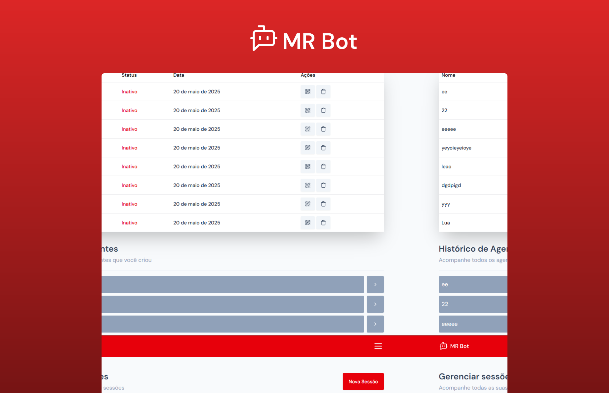

# Mr Bot 🤖

### Seu Assistente de IA Inteligente para WhatsApp

**Mr Bot** é um agente de inteligência artificial robusto e personalizável, projetado para ser integrado perfeitamente ao **WhatsApp**. Ele automatiza interações, oferece suporte ao cliente, responde a perguntas frequentes e otimiza a comunicação para empresas e indivíduos, proporcionando uma experiência de usuário eficiente e escalável.

#### Como funciona o sistema de sessões?

O Mr Bot opera com um sistema de **sessões**, onde cada sessão representa uma conversa contínua ou uma sequência de interações com o usuário dentro de um período de tempo definido. Nossos planos são adaptados para diversas necessidades e volumes de uso:

- **Plano Básico:** Inclui **2 sessões**. Ideal para testar as funcionalidades e uso pessoal limitado.
- **Plano Premium:** Oferece **5 sessões**. Perfeito para pequenas empresas ou uso mais frequente, proporcionando maior flexibilidade.
- **Plano Platinum:** Garante **20 sessões**. Projetado para alta demanda e negócios com grande volume de interações diárias.

---

### ✨ Principais Funcionalidades

- **Integração Nativa com WhatsApp:** Comunicação direta e fluida com seus usuários ou clientes através da plataforma de mensagens mais popular.
- **Automação Inteligente:** Automatize respostas para perguntas frequentes, forneça informações e gerencie interações 24/7.
- **Planos Flexíveis de Sessões:** Escolha o plano que melhor se adapta ao seu volume de uso e necessidade, garantindo escalabilidade.
- **Tecnologias Modernas:** Construído com um stack de ponta para garantir performance, segurança e uma interface de usuário responsiva.

---

### 🚀 Tecnologias Utilizadas

Este projeto é desenvolvido com as seguintes tecnologias modernas, que garantem robustez e uma experiência de desenvolvimento ágil:

- **[Next.js 15](https://nextjs.org/)**: Um framework React de alto desempenho para aplicações web, otimizado para produção.
- **[Tailwind CSS v4](https://tailwindcss.com/)**: Um framework CSS utilitário para design rápido e responsivo, permitindo uma estilização altamente customizável.
- **[Shadcn UI](https://ui.shadcn.com/)**: Uma coleção de componentes de UI bonitos e acessíveis, construídos com Radix UI e Tailwind CSS, focados na reusabilidade.
- **[React Hook Form](https://react-hook-form.com/)**: Uma biblioteca para gerenciamento de formulários complexos no React, focada em performance e usabilidade.
- **[Zod](https://zod.dev/)**: Uma biblioteca de validação de esquemas TypeScript-first, garantindo a integridade dos dados de entrada.

---

### ⚙️ Instalação e Configuração

Siga os passos abaixo para configurar e rodar o Mr Bot em seu ambiente de desenvolvimento local.

#### Pré-requisitos

Certifique-se de ter as seguintes ferramentas instaladas em sua máquina:

- **[Node.js](https://nodejs.org/en/)** (versão LTS recomendada, ex: 18.x ou superior)
- **[npm](https://www.npmjs.com/)** (gerenciador de pacotes do Node.js, geralmente vem com o Node.js) ou **[Yarn](https://yarnpkg.com/)**

#### Passos de Instalação

1.  **Clone o repositório:**
    Abra seu terminal e execute o comando:

    ```bash
    git clone [https://github.com/seu-usuario/mr-bot.git](https://github.com/seu-usuario/mr-bot.git)
    cd mr-bot
    ```

    _(**Nota:** Substitua `https://github.com/seu-usuario/mr-bot.git` pelo URL real do seu repositório.)_

2.  **Instale as dependências:**
    Navegue até o diretório do projeto e instale todas as dependências necessárias:

    ```bash
    npm install
    # ou, se preferir Yarn:
    # yarn install
    ```

3.  **Rode o projeto em modo de desenvolvimento:**
    Após configurar as variáveis de ambiente, você pode iniciar o servidor de desenvolvimento:

    ```bash
    npm run dev
    # ou
    # yarn dev
    ```

    O aplicativo estará acessível em `http://localhost:3000`.

4.  **Para produção (opcional):**
    Para construir e rodar o projeto em um ambiente de produção otimizado:
    ```bash
    npm run build
    npm start
    # ou
    # yarn build
    # yarn start
    ```

---

### 👨‍💻 Desenvolvido por

- Paulo Ricardo em 20 de Maio de 2025
